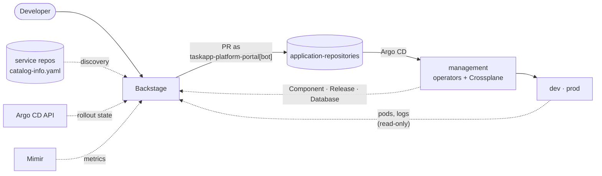

# backstage

The platform's developer portal, built on [Backstage](https://backstage.io).
It's the only interface a developer needs: golden paths to onboard a service,
deploy a version or add a database, and one page per service showing what runs
where, whether it's healthy, and what it depends on.

Live at [platform.gerodimos.dev](https://platform.gerodimos.dev): sign in as
guest to browse read-only. The cluster is rebuilt daily, so it's up only while
being worked on.

- **Every action is a pull request.** Templates render a small file into
  [application-repositories](https://github.com/entr0pian/application-repositories)
  and open a PR as the portal's own GitHub App. Backstage never writes to a
  cluster.
- **Read-only to the world.** Guests can browse everything safe to show. Only
  the owner's GitHub sign-in can run templates or see logs.
- **No per-service setup.** Services appear in the catalog, the Deployments tab
  and the Metrics tab because of the labels the platform already puts on them.

## Where it fits



Solid arrows are what a developer causes. Dotted arrows are what the portal
reads to show the result.

## Golden paths

| Template | Asks for | Opens a PR adding |
|---|---|---|
| **Onboard a service** | name, owner, visibility, scaffold template and version (from [platform-scaffolds](https://github.com/entr0pian/platform-scaffolds) tags), auto-deploy on or off | `platform/registry/<name>.yaml` (`Component`) and, with auto-deploy, its first `Release` following `main` |
| **Create deployment** | component, environment, a green build (or auto-deploy instead), which databases to bind | `platform/environments/<env>/<name>-release.yaml` (`Release`) |
| **Add a database** | component, environment, database name, size | `platform/environments/<env>/<name>-db.yaml` (`Database`) |

After the merge, the operators take over:
[component-operator](https://github.com/entr0pian/component-operator) creates
and scaffolds the repository,
[release-operator](https://github.com/entr0pian/release-operator) writes the
deployment, and [crossplane-compositions](https://github.com/entr0pian/crossplane-compositions)
provisions the database.

## A service's page

| Tab | Shows | Source |
|---|---|---|
| Overview | owner, repository, dependencies | catalog entity from the repo's `catalog-info.yaml` |
| Deployments | one card per environment: version, what changed, live rollout steps, sync and health; a Details drawer with the public URL; Logs for the owner | `Release`s on management, the Argo CD API, the workload clusters |
| Metrics | one golden-signals card per environment (request rate, 5xx %, p95, CPU and memory as % of limit, replicas, restarts) and a link to Grafana | Mimir, through a fixed-query backend route |
| Dependencies | the databases a service owns and binds, per environment | `Database` resources, published as catalog `Resource` entities |

## How it's built

Stock Backstage plugins (catalog, scaffolder, Kubernetes, the community Argo CD
plugin) plus a few small platform modules in this repo:

| Module | Does |
|---|---|
| `platformEntityProvider` | Reads `Database` resources from management and publishes them as catalog entities linked to their `Component` |
| `releaseVersions` | Backend routes under `/api/platform/*`: Releases, deployable builds, committed Release files, scaffold versions, environment and database details |
| `observabilitySummary` | `GET /api/platform/observability/components/:c/environments/:e`. It accepts only the two names and runs fixed PromQL against Mimir, so guests can't send arbitrary queries |
| `platformClusters` | Adds the registered workload clusters to the Kubernetes plugin, reached with a read-only IAM role |
| `argocdAnnotator` | Stamps an `argocd/app-selector` on every component, so the Argo CD plugin finds its Applications by the platform's labels |
| `permissionPolicy` | An explicit allowlist for guests. A permission a new plugin introduces stays denied until it's listed |

## Design choices

- **PRs, not API calls.** A template that wrote to a cluster would bypass
  review and Git history. A PR is reviewable, revertable, and the same path
  everything else takes.
- **Fixed queries for guests.** Exposing a Prometheus proxy would let anyone run
  any query. One route with two path parameters exposes exactly the numbers on
  the page.
- **Discovery by label, not by name.** Argo CD Applications and Kubernetes
  workloads are found through `platform.taskapp.io/{component,environment}`,
  so naming conventions can change without breaking the portal.
- **A GitHub App, not a PAT.** PRs come from `taskapp-platform-portal[bot]`
  with short-lived tokens, not from a person's account.

## Delivery

On every push, CI type-checks, runs the Onboard Service template render test
and builds the backend. On `main` it pushes `ghcr.io/entr0pian/backstage:<sha>`,
then the shared `bump-infra` workflow in application-repositories pins the
chart and image to that SHA, and Argo CD rolls it out to `management`. The
Helm chart is in `chart/`. Its credentials (GitHub App, OAuth, Argo CD token,
cluster access) come from AWS Secrets Manager through External Secrets.

## Development

```sh
yarn install
yarn start      # app + backend, against app-config.yaml
yarn tsc
yarn test
```
